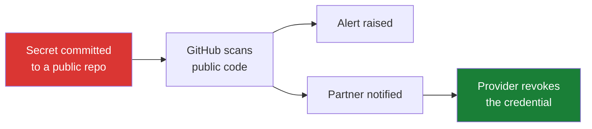

# my-cabbages — public monitoring demo

A deliberately small, fictional service ("HotPot Express") used to demonstrate **GitHub secret scanning public monitoring**.

## What this demo shows

A credential **lands** in a public repository. GitHub detects it and notifies the provider, who can revoke it.

The secret **does** reach GitHub here. That is the point — this is the safety net for credentials that are already exposed.

## This is not the push protection demo

Push protection is the *opposite* flow: the push is rejected and the secret never reaches the remote at all. The two stories have opposite endings and should not be mixed in one narrative.

The push protection demo lives in a separate internal repository — ask in the Secret Protection channel if you need access. It is kept separate deliberately: a repository that has ever recorded a bypass cannot illustrate a clean block.

Note also that this repository's alert history records a **bypassed** push-protection block, so it cannot be used to illustrate a clean block. That is the correct behaviour to record — a bypass is an auditable escape hatch — but it is not launch collateral.

## Current state

The two open alerts are intentional; they are the artifact this demo exists to produce. Both credentials are **synthetic** — random values matching the providers' formats, with nothing behind them to revoke.

| Alert | Type | Note |
|---|---|---|
| #1 | GoCardless Live Access Token | Committed, detected |
| #2 | Hugging Face User Access Token | Pushed via a push-protection bypass |

## Known rough edges

The narrative is inconsistent: the code is a fictional payment integration ("SimmerPay"), but the credentials are Hugging Face and GoCardless patterns. A screenshot therefore shows *"Hugging Face User Access Token"* against a payments file. Detection requires a real provider pattern — a fictional provider would not be detected at all — so the fix is to align the story to the provider, not the other way round.
