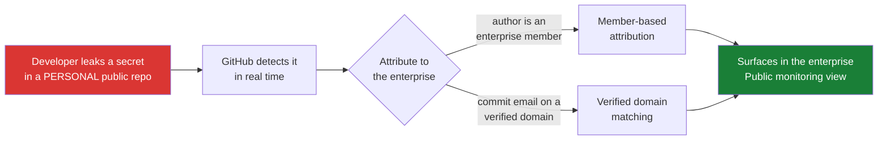

# my-cabbages — public monitoring demo

A deliberately small, fictional service ("HotPot Express") used to demonstrate
**public monitoring** for secret scanning — currently in public preview.

This is the demo for the public monitoring launch. It is not a push protection
demo, and the distinction matters (see [below](#not-to-be-confused-with-push-protection)).

## What public monitoring does

Secret scanning normally covers the repositories your enterprise owns. Public
monitoring extends it to **anywhere your developers work on GitHub.com** —
personal projects, forks, issues, pull requests, discussions, wikis — and
attributes what it finds back to your enterprise.

## Why this repo is personal, not enterprise-owned

That is the entire point. This repository belongs to an individual, not to the
enterprise — so it sits **outside** the boundary that ordinary secret scanning
covers. A leak here would previously have been invisible. Public monitoring is
what makes it visible.

If you move this demo into an org-owned repository, you are no longer
demonstrating public monitoring. You are demonstrating ordinary secret scanning.

## It exercises both attribution paths

The changelog calls out two ways a finding is tied back to your enterprise.
This repo happens to cover both, which is worth pointing out when presenting:

| Commit | Author | Email | Attribution path |
|---|---|---|---|
| `4030af9` | `erinhav` | `erinhav@github.com` | **Verified domain matching** — a work email on a verified domain |
| `f2ae91e` | `not-picasso` | `…@users.noreply.github.com` | **Member-based** — the account belongs to the enterprise |

The second is the more interesting story: a *different, personal-looking*
account, committing to a *personal* repository, still attributed correctly.

## Where the findings appear

Enterprise **Security → Public monitoring**.

Note that public monitoring findings are **UI-only** — there is no REST endpoint
for them (`/enterprises/{ent}/secret-scanning/public-monitoring/alerts` returns
404, and the general enterprise secret-scanning alerts endpoint does not include
them). So there is no scripted way to confirm the demo is working before you
present. **Open the enterprise view and look, every time.**

The repo-level alerts on this repository are ordinary secret scanning alerts and
are *not* the public monitoring surface. Don't screenshot them and call them
public monitoring.

## Current state

Both credentials are **synthetic** — random values matching the providers'
formats, with nothing behind them to revoke.

| Alert | Type | Note |
|---|---|---|
| #1 | GoCardless Live Access Token | Committed directly |
| #2 | Hugging Face User Access Token | Landed via a push protection bypass |

The bypass on #2 was a legitimate staging step, not a defect: push protection
would otherwise have blocked the secret from landing, and public monitoring
needs it to land. Worth knowing so it isn't mistaken for a failure — but still
don't put a screenshot of the bypass dialog in launch collateral.

## Not to be confused with push protection

Push protection is the *opposite* flow: the push is rejected and the secret
never reaches GitHub at all. Public monitoring is the safety net for credentials
that are **already exposed**. The two have opposite endings and should not be
mixed in one narrative.

The push protection demo lives in a separate internal repository — ask in the
Secret Protection channel if you need access.

## Known rough edge

Commit `4030af9` is coherent: a payments integration leaking a **GoCardless**
payments token. Commit `f2ae91e` then swapped in a **Hugging Face** token, which
left the current state showing an ML credential inside a payments file.

Detection requires a real provider pattern — a fictional provider would not be
detected at all — so the fix is to align the story to the provider, not the
reverse. Changing it now would raise a fresh alert and disturb the two
attribution paths above, so it has been left as-is deliberately.
